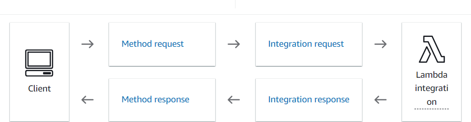
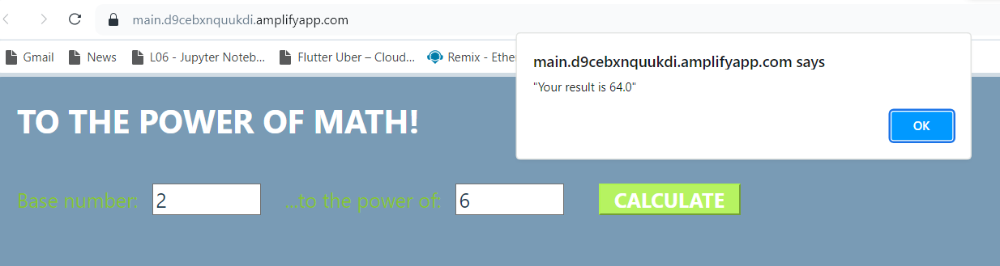
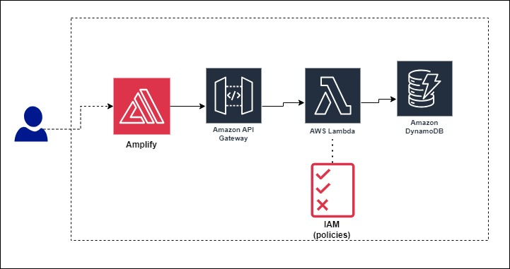

# Website-AWS- Power of Math
Deploying End to End Website on AWS

steps

1. Deploy using Amplify (connect this repo) - Way to create/host a webpage
2. Lambda function to do the math things- write the lambda function for power of math, also write test event to check if the function works correctly or not.
3. API Gateway - to trigger the function and also to build my own api (http/ rest / websocket) In this case, we will use REST API.

4. Now we want to store the final result. We will use DynamoDB ( A key-value noSQL database) 
5. Then setting up the permissions(IAM) for executing lambda. Basically lambda function to have the permission to write into the table.
6. So now we just connect Amplify and Lambda function, for that we will update the index.html

The final product

The whole architecture of this:

## Notes: After testing this, do not forget to delete the app from amplify, table from DynamoDB and lambda functions also, so that it won't cost you anything.
